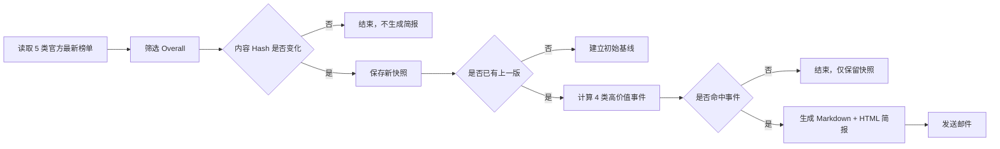

# Arena 榜单监控 V1 方案

## 一句话定义

每天检查 5 个 Arena 一级榜单的 Overall 分类；只有出现新模型、模型消失、榜首更换、进入/跌出 Top 3 或 Top 10 时，才生成一份中文简报。

## 1. V1 设计决定

### 使用场景

- V1 面向每日简报场景，不做公开查询网站。
- 输出以中文为主。
- 当天没有值得关注的变化时，不发邮件。

### 首版 5 类榜单

1. **Text**：通用文字任务；使用网站默认的 style-controlled Overall 数据。
2. **Agent**：Agent Arena 综合榜；采用 IPS 分数体系，只在本榜单内部比较。
3. **WebDev**：文字需求生成前端网页的能力榜单。
4. **Text-to-Image**：文字生成图片的能力榜单。
5. **Image Edit**：图片编辑能力榜单。

其中，WebDev 不是通用编程榜。它更偏 HTML、CSS、JavaScript、React、落地页、看板和网页交互的生成效果。

### 首版只保留 4 类事件

| 事件 | V1 是否通知 | 表达方式 |
|---|---:|---|
| 新模型进入榜单 | 是 | 模型名 + 当前排名 |
| 模型从榜单消失 | 是 | 模型名 + 上期排名 |
| 榜首变化 | 是 | 原榜首 → 新榜首 |
| 进入/跌出 Top 3 | 是 | 原排名 → 新排名 |
| 进入/跌出 Top 10 | 是 | 原排名 → 新排名 |
| 普通排名变化 | 否 | 暂不处理 |
| 分数或票数变化 | 否 | 暂不处理 |

“消失”和“弃用”必须区分：数据里不再出现只能说明模型消失；只有 Arena 官方变更日志明确说明时，才写成弃用。

## 2. 数据与比较口径

主数据源使用 Arena 官方发布在 Hugging Face 的历史榜单数据集：

| 榜单 | subset | category |
|---|---|---|
| Text | `text_style_control` | `overall` |
| Agent | `agent` | `overall` |
| WebDev | `webdev` | `overall` |
| Text-to-Image | `text_to_image` | `overall` |
| Image Edit | `image_edit` | `overall` |

每次运行保存一份带时间和内容 Hash 的不可变快照，并与上一个有效快照比较。首次运行只建立基线，不应把所有现有模型误报成“新模型”。

Agent 的 `score` 是 IPS 指标；其他四类主要使用 Arena rating。V1 只判断排名边界和成员变化，因此不会把两套分数误混在一起。

## 3. 每日运行逻辑

## 4. 首版邮件结构

邮件标题：

> [Arena 榜单] 2026-07-23：3 类榜单有重要变化

正文按发生变化的榜单分组，每条包含模型、变化前后排名和原榜单链接。没有变化的类别不占篇幅。

## 5. 首版边界

V1 暂不包含：

- Text 的语言、编程、数学等二级分类；
- Agent 的 5 个子信号；
- WebDev 的 HTML、React、网站类型等细分；
- Image-to-WebDev；
- 趋势图、置信区间噪声过滤、分数显著性判断；
- 自动从 Changelog 判定“弃用”；
- 公开查询网站。

这些内容适合在首版稳定运行后按实际使用价值逐项加入。

## 6. 运行建议

- 调度：由部署者通过 cron、systemd timer、GitHub Actions 或其他调度器执行。以北京时间每天 09:00 为例，cron 表达式为 `0 1 * * *`。
- 通知：无重要变化时不发送通知；邮件、飞书等渠道按需启用。
- 存储：保留不可变快照和历史简报，用于后续比较和审计。
- GitHub Actions：通过仓库 Secret 读取通知配置，并在命中重要变化时发送消息卡片。

项目同时保留 GitHub Actions + SMTP 的可移植方案，适合按部署环境自行选择。
